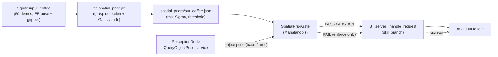

# Spatial-Prior Gating for BT Skills

> Status: implemented, **shadow mode by default**. First target task:
> `put_coffee` / skill `pick_and_insert_capsule`.

This document records, in detail, why the spatial-prior gate exists, how it was
designed, how it was built from the real training data, how it is wired into the
runtime, and the exact path to enable it on the robot. It is meant to be the
single source of truth for the architecture evolution of this feature.

---

## 1. Problem and motivation

The BT runtime already had **one** scene check before/after each learned skill:
the **VLM gate** (`VlmNode` in `panda_live_viewer`, orchestrated by the
`AwaitScene` / VLM-request flow in `server.py`). The VLM answers a *semantic*
question:

> "Is the task complete / is the scene correct?"

The VLM is good at semantics but is a **poor metric and spatial judge**: it is
slow, non-deterministic, and cannot reliably answer *"is this object a few
centimetres outside the region where the policy was trained?"*. Yet that
spatial question is exactly what determines whether an Action-Chunking
Transformer (ACT) policy will behave well. ACT policies are **behaviour cloning**
models: outside the spatial support of their training demonstrations they
extrapolate, and extrapolation on a real arm is unsafe and unreliable.

We therefore added a **second, independent gate** that answers a different,
quantitative question:

> "Is the object the policy is about to manipulate located **where the policy
> was actually trained** to handle it?"

This is an **out-of-distribution (OOD) detector** on the object position. It is
deterministic, fast, GPU-free, and repeatable.

### Why two independent gates (and not one merged check)

| Gate | Question | Method | Fails when… |
| --- | --- | --- | --- |
| Spatial prior (new) | Is the object in the trained region? | Mahalanobis distance to a Gaussian fitted from demos | Object placed outside the demonstrated workspace |
| VLM (existing) | Is the task semantically done/correct? | VLM reasoning over camera frames | Wrong/missing object, task not completed |

They fail for **different reasons** and must stay **separate**. Merging them
would hide one signal behind the other. The gates run in cascade: the spatial
prior is checked **before** the skill executes; the VLM check runs as before.

---

## 2. What the training data actually contains

The referenced models and their datasets:

- `Squitieri/putcoffee_act16_100k`  ← dataset `Squitieri/put_coffee`
- `Squitieri/closemachine_act16_100k` ← dataset `Squitieri/close_machine_fixed`

> Note: the HF model cards show generic SO100 (`so100_follower`) boilerplate.
> That is **not** the real robot. The real robot is the Franka Panda exposed
> through `custom_manipulator`. Do not trust the model-card robot type.

`Squitieri/put_coffee` (LeRobot dataset, codebase `v3.0`):

- **50 episodes**, 9957 frames, 10 fps, `robot_type: custom_manipulator`.
- Per-frame features (`meta/info.json`):
  - `observation.state` — **7D end-effector Cartesian pose**:
    `[position.x, position.y, position.z, orientation.x, orientation.y,
    orientation.z, gripper]`
  - `action` — same 7D Cartesian command
  - `observation.images.wrist_rgb`, `observation.images.left_rgb` — video
  - bookkeeping: `timestamp, frame_index, episode_index, index, task_index`

**Key fact:** the dataset stores the **end-effector Cartesian pose in the robot
base frame** plus a scalar gripper opening. There is **no explicit 6D object
pose label**. This drove the proxy design below.

### The grasp-instant proxy

Because there is no object-pose label, we use the **end-effector position at the
grasp instant** as a proxy for the object position. The grasp instant is the
frame where the gripper transitions from open to closed — that is when the
end-effector is physically at the object.

Empirically validated on all 50 `put_coffee` episodes (gripper open ≈ `0.085`,
closed ≈ `0.006–0.03`):

```
grasp EE position over 50 demos (base frame, metres):
  mean  = [0.6843, -0.2604, 0.1502]
  std   = [0.0261,  0.0276,  0.0048]
  range = x[0.626, 0.733]  y[-0.325, -0.201]  z[0.141, 0.162]
  covariance condition number = 36  (well-conditioned, invertible)
  leave-one-out acceptance    = 100% of held-out demos PASS at level 0.99
```

This is a tight, unimodal cluster — exactly the *"oggetti abbastanza varianti ma
non tanto"* (moderately varied, ~5 cm spread) regime the user described. It is
ideal for a Gaussian OOD gate.

> **Documented modelling caveat.** The grasp-EE position differs from a
> perception *object centroid* by a roughly **constant grasp offset** (gripper
> geometry + approach direction). The prior mean is therefore offset from where
> perception will report the object. This is the main reason the gate ships in
> **shadow mode**: on the robot we first *measure* the real observed-vs-prior
> distance, then calibrate the offset and/or threshold before enforcing.

---

## 3. The gate algorithm

### Offline (once per skill)

1. Download only the dataset's state parquet + metadata (never the videos).
2. For each episode, find the grasp instant (first frame where the gripper
   opening drops below `open - 0.5 * (open - min)`; fallback to the
   minimum-opening frame).
3. Collect the grasp EE positions `{p_i} ⊂ ℝ³`.
4. Fit a Gaussian: `mu = mean(p_i)`, `Sigma = cov(p_i)` (unbiased, ddof=1).
5. Choose the acceptance threshold from the chi-square distribution: the squared
   Mahalanobis distance of an in-distribution sample is `χ²(dof=3)`, so the
   threshold on the (non-squared) Mahalanobis distance is
   `sqrt(chi2.ppf(level, 3))`. Default level `0.99` → `3.3682`.
6. Save a prior JSON (`schema_version`, `skill`, `object`, `frame_id`, `mu`,
   `sigma`, `n_demos`, `mahalanobis_threshold`, provenance metadata).

### Runtime (before each gated skill)

1. Query the perception `QueryObjectPose` service for the object position in the
   target base frame.
2. Compute the Mahalanobis distance `d` of the observed position to `(mu, Sigma)`
   (covariance is regularized with a small isotropic floor so a near-flat axis,
   e.g. table-height `z`, never breaks inversion).
3. Verdict:
   - `d ≤ threshold` → **PASS** (in-distribution)
   - `d > threshold` → **FAIL** (out-of-distribution)
   - cannot decide → **ABSTAIN**

### When the gate ABSTAINS (and never blocks)

ABSTAIN is the safety-preserving default whenever a trustworthy decision is
impossible:

- No object pose available from perception.
- **Frame mismatch** — perception returned a *camera-frame* pose instead of the
  base frame. This is the **current real-robot state**: without calibrated
  hand-eye transforms (`camera_static_tf_map` is empty), the perception node
  marks poses `tf_unavailable` and returns camera-frame coordinates, which are
  **not comparable** to a base-frame prior.
- Perception confidence below `min_pose_confidence`.
- Perception service unavailable / timeout / error.
- Invalid (NaN/inf or wrong-shape) pose values.

ABSTAIN never blocks a skill in any mode.

---

## 4. Runtime modes

Configured per executor YAML under `spatial_prior_gate.mode`:

| Mode | Evaluates | Logs | Blocks on FAIL |
| --- | --- | --- | --- |
| `off` | no | no | no |
| `shadow` | yes | yes | **no** |
| `enforce` | yes | yes | yes |

`shadow` is the recommended first deployment: it surfaces the verdict and the
measured distance in the logs without ever changing BT behaviour, so the offset
and threshold can be calibrated against real perception data.

---

## 5. Code map (what was added / changed)

All paths under `lerobot/src/lerobot_bt_python/` unless noted.

| File | Role | New? |
| --- | --- | --- |
| `spatial_prior.py` | Pure-numpy core: `SpatialPrior` (load/save, Mahalanobis, `evaluate → PASS/FAIL/ABSTAIN`), `SpatialPriorVerdict`, `chi_square_threshold`. | new |
| `fit_spatial_prior.py` | Offline CLI fitter: dataset → grasp positions → Gaussian → prior JSON, with leave-one-out sanity check. | new |
| `spatial_prior_gate.py` | Runtime orchestrator: loads priors, parses perception `pose_json`, evaluates per skill, decides `should_block`. ROS-agnostic (pose provider injected). | new |
| `spatial_priors/put_coffee.json` | Fitted prior for `pick_and_insert_capsule` (50 demos). | new |
| `test_spatial_prior.py` | 27 unit tests (checker, fitter, parser, gate modes). | new |
| `config.py` | Added `SpatialPriorGateConfig` + `SkillCommandServerConfig.spatial_prior_gate` (defaults to `off`). | changed |
| `bt_interface_paths.py` | Added `load_query_object_pose_service()`. | changed |
| `server.py` | Build the gate, create a `QueryObjectPose` client when enabled, add `_query_object_pose` pose provider, evaluate the gate before each skill (block only in `enforce`). | changed |
| `make_coffee_executor.yaml` | Added a `spatial_prior_gate` block (mode `shadow`) for the coffee task. | changed |

Cross-package note: `QueryObjectPose.srv` lives in `lerobot_bt_interfaces`
**inside this repo**, so the BT server uses it natively — no dependency on
`panda_live_viewer` code, only on the running perception service at runtime.

### Data flow



---

## 6. How to (re)generate a prior

```bash
conda activate lerobot
cd ~/lerobot/src
python3 -m lerobot_bt_python.fit_spatial_prior \
  --dataset-repo-id Squitieri/put_coffee \
  --skill pick_and_insert_capsule \
  --object coffee_capsule \
  --output lerobot_bt_python/spatial_priors/put_coffee.json
```

The fitter prints the demo count, `mu`, per-axis std, the Mahalanobis threshold,
and the leave-one-out acceptance rate (a healthy unimodal prior accepts close to
the configured level). Only the state parquet + metadata are downloaded; videos
are never pulled.

---

## 7. How to enable on the robot

1. **Start in shadow mode** (already configured in `make_coffee_executor.yaml`):
   ```yaml
   spatial_prior_gate:
     mode: shadow
     skill_priors: { pick_and_insert_capsule: "put_coffee.json" }
     skill_objects: { pick_and_insert_capsule: "coffee_capsule" }
   ```
2. Run the BT server with the perception node up and publishing `scene_facts`.
3. Watch the logs for `event=spatial_prior_gate` lines. Each line reports the
   `status`, `reason`, measured `distance`, `threshold`, and `frame`.
   - If you see `status=ABSTAIN reason=frame_mismatch...`, the hand-eye
     calibration is missing — perception is returning camera-frame poses.
     **Populate `camera_static_tf_map`** with calibrated base→camera transforms
     so perception lifts poses into `base_link`.
4. With poses in `base_link`, the shadow logs show real `distance` values.
   Account for the **grasp offset** (Section 2): the observed object-centroid
   distance will be biased relative to the grasp-EE prior. Two options:
   - re-fit/adjust `mu` by the measured offset, or
   - raise the `mahalanobis_threshold` / use a looser `confidence_level`.
5. Only after the shadow distances look sane, switch `mode: enforce`.

### Prerequisites for a non-abstaining gate

- Perception node running and publishing `/perception/scene_facts`.
- The queried object (`coffee_capsule`) present in the perception registry and
  detectable.
- **Calibrated hand-eye transforms** so poses are in `base_link` (the prior's
  `frame_id`). Without this the gate correctly ABSTAINS.

---

## 8. Safety properties

- **Fail-safe by construction:** any uncertainty → ABSTAIN → never blocks.
- **No new motion, timing, or control-loop coupling:** the gate runs once,
  synchronously, before the skill rollout starts; it never touches the control
  loop. The `QueryObjectPose` call is bounded by `query_timeout_s` (default 2 s).
- **Inert by default:** `mode` defaults to `off`; existing deployments are
  unchanged until a YAML opts in.
- **Independent of the VLM gate:** does not modify or merge with the VLM /
  semantic verification path.

---

## 9. Known limitations / future work

- The prior models **object position only** (3D translation). Orientation is
  available in the dataset and could be added as a separate gate, but position
  is the robust, primary OOD signal.
- The grasp-EE proxy carries a constant offset vs perception object centroids;
  calibrate in shadow mode (Section 7). A future improvement is to record paired
  (perceived object pose, grasp pose) data and learn the offset directly.
- A single Gaussian assumes a **unimodal** workspace. For multi-region tasks,
  switch to a Gaussian mixture and gate on the minimum per-component Mahalanobis
  distance. `put_coffee` is unimodal (LOO = 100%), so a single Gaussian is
  appropriate today.
- `close_coffee_machine` is intentionally **not** gated yet (task focuses on
  `put_coffee` first). The same pipeline applies to its dataset
  (`Squitieri/close_machine_fixed`) when needed.
