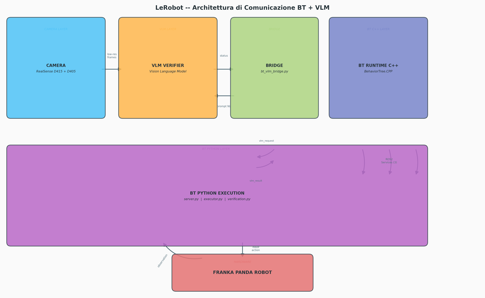
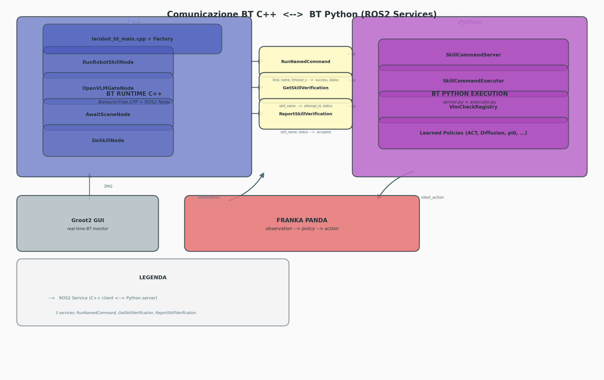
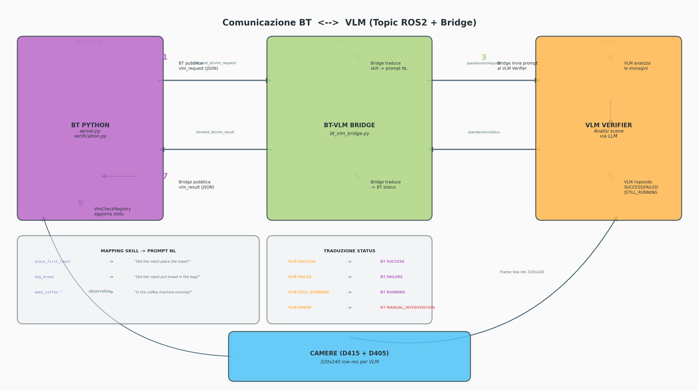

# LeRobot BT Stack — Architettura & Diagrammi

Questo documento unifica documentazione e diagrammi dell'intero stack
Behavior Tree di LeRobot, inclusa la comunicazione con il VLM (Vision Language Model).

---

## Indice

1. [Panoramica dell'architettura](#1-panoramica-dellarchitettura)
2. [BT C++ ↔ BT Python (ROS2 Services)](#2-bt-c--bt-python-ros2-services)
3. [BT ↔ VLM (Topic ROS2 + Bridge)](#3-bt--vlm-topic-ros2--bridge)
4. [Deployment multi-macchina](#4-deployment-multi-macchina)
5. [Convenzioni VLM, BT e BC](#5-convenzioni-vlm-bt-e-bc)
6. [Struttura dei dataset](#6-struttura-dei-dataset)

---

## 1. Panoramica dell'architettura

Il runtime segue un modello a tre attori:

```text
BehaviorTree.CPP   →  decide ordine, attese e retry
Python Executor    →  esegue una BC skill o apre un VLM gate
VLM Verifier       →  riporta SUCCESS, FAILURE, RUNNING, o azioni richieste
```

**Non esiste un supervisor separato.** Se il VLM riporta `FAILURE`, il nodo XML
`RetryUntilSuccessful` ri-esegue la stessa BC skill dall'inizio.



### Layer del sistema

| Layer | Componenti | Colore |
|-------|-----------|--------|
| **Camera** | RealSense D415 (front) + D405 (wrist) → topic ROS2 `image_compressed` + stream low-res 320×240 per VLM | Blu |
| **VLM Verifier** | Analisi scene via LLM (Qwen3-VL). Riceve prompt NL, risponde con status | Arancione |
| **Bridge** | `bt_vlm_bridge.py` — traduce protocollo BT (JSON) ↔ VLM (String), skill name → prompt NL | Verde |
| **BT Runtime C++** | `BehaviorTree.CPP` + nodi custom (`RunRobotSkillNode`, `OpenVLMGateNode`, `AwaitSceneNode`, `DoSkillNode`) | Indaco |
| **BT Python** | `server.py` (ROS2 service server), `executor.py` (policy rollout), `verification.py` (VlmCheckRegistry) | Viola |
| **Hardware** | Franka Panda + Robotiq gripper | Rosso |

### Flusso di una skill con verifica VLM

1. **BT C++** → `RunNamedCommand(kind="skill", name="place_first_toast")` → **BT Python**
2. **BT Python** → `executor.py` carica policy (ACT/Diffusion/π0) e la esegue sul robot
3. Skill completata → **BT C++** → `GetSkillVerification(skill_name="place_first_toast")` → **BT Python**
4. **BT Python** → pubblica `/lerobot_bt/vlm_request` (JSON) → **Bridge**
5. **Bridge** → traduce `skill_name` in prompt NL → pubblica `/panda/vlm/request`
6. **VLM** analizza le immagini camera → risponde `SUCCESS` / `FAILED` / `STILL_RUNNING`
7. **Bridge** → traduce status → pubblica `/lerobot_bt/vlm_result`
8. **VlmCheckRegistry** aggiorna lo stato → BT C++ riceve il verdetto

---

## 2. BT C++ ↔ BT Python (ROS2 Services)

La comunicazione tra il BT C++ e il layer Python avviene esclusivamente tramite
**3 servizi ROS2** (comunicazione sincrona request/response).



### Servizi ROS2

| Service | Request | Response |
|---------|---------|----------|
| `RunNamedCommand` | `kind`, `name`, `timeout_s` | `success`, `status`, `elapsed_s`, `message` |
| `GetSkillVerification` | `skill_name` | `has_attempt`, `attempt_id`, `status`, `message` |
| `ReportSkillVerification` | `skill_name`, `attempt_id`, `status` | `accepted`, `applied_attempt_id` |

### Nodi BT custom (C++)

| Nodo | `kind` | Scopo |
|------|--------|-------|
| `RunRobotSkillNode` | `skill` | Esegue una policy appresa sul robot |
| `OpenVLMGateNode` | `vlm_gate_pending` | Apre un gate di verifica VLM |
| `AwaitSceneNode` | merged | Esegue comando + polling verifica (gate) |
| `DoSkillNode` | merged | Esegue comando + polling verifica (skill) |

### Componenti Python interni

| Componente | File | Ruolo |
|-----------|------|-------|
| `SkillCommandServer` | `server.py` | ROS2 Node che riceve i servizi dal BT C++ |
| `SkillCommandExecutor` | `executor.py` | Carica ed esegue le policy (ACT, Diffusion, π0, SmolVLA, ...) |
| `VlmCheckRegistry` | `verification.py` | Stato in-memory delle verifiche VLM per skill |
| `Learned Policies` | `lerobot.policies.*` | Modelli pre-addestrati per manipolazione |

---

## 3. BT ↔ VLM (Topic ROS2 + Bridge)

La comunicazione col VLM avviene tramite **topic ROS2 asincroni**, con il
`bt_vlm_bridge.py` che fa da traduttore di protocollo.



### Topic ROS2

| Topic | Direzione | Formato | Contenuto |
|-------|-----------|---------|-----------|
| `/lerobot_bt/vlm_request` | BT Python → Bridge | JSON | `skill_name`, `attempt_id`, `status` |
| `/panda/vlm/request` | Bridge → VLM | String | Prompt in linguaggio naturale |
| `/panda/vlm/status` | VLM → Bridge | String | `SUCCESS`, `FAILED`, `STILL_RUNNING`, `ERROR` |
| `/lerobot_bt/vlm_result` | Bridge → BT Python | JSON | `skill_name`, `attempt_id`, `status`, `message` |

### Traduzione status VLM → BT

| VLM Status | BT Status | Effetto |
|-----------|-----------|---------|
| `SUCCESS` | `SUCCESS` | Skill riuscita, albero prosegue |
| `FAILED` | `FAILURE` | Skill fallita, albero ritenta |
| `STILL_RUNNING` | `RUNNING` | VLM ancora in elaborazione, BT in attesa |
| `ERROR` | `MANUAL_INTERVENTION_REQUIRED` | Errore infrastruttura, ferma tutto |

### Mapping skill → prompt NL (esempi)

| BT Skill | Prompt VLM |
|----------|-----------|
| `place_first_toast` | *"Did the robot correctly place the first slice of toast on the plate?"* |
| `bag_bread` | *"Did the robot correctly place the bread into the picnic bag?"* |
| `pour_ingredient` | *"Did the human pour the ingredient onto the sandwich?"* |
| `make_coffee.*` | *"Is the coffee-making workspace set up correctly?"* |

### Payload JSON atteso

**Richiesta BT:**
```json
{
  "event": "vlm_check_requested",
  "skill_name": "place_first_toast",
  "attempt_id": 0,
  "status": "PENDING",
  "message": "..."
}
```

**Risultato BT:**
```json
{
  "skill_name": "place_first_toast",
  "attempt_id": 0,
  "status": "SUCCESS",
  "message": "VLM reports scene is correct"
}
```

---

## 4. Deployment multi-macchina

Il BT stack e il VLM girano su **due macchine separate** che comunicano via ROS 2:

```text
┌── IITICB001DW001 (robot machine) ──┐    ┌── iitbmp014srv002 (GPU server) ──┐
│                                     │    │                                  │
│  panda_camera_publisher.py          │─── │  panda_vlm_live.py               │
│  (RealSense → CompressedImage)      │ROS2│  (Qwen3-VL model, inference)     │
│                                     │    │                                  │
│  lerobot-bt-skill-server  (Python)  │─── │  ascolta:                        │
│  lerobot_bt_runner        (C++ BT)  │ROS2│  /lerobot_bt/vlm_request         │
│                                     │    │  pubblica:                       │
│  Panda robot + Robotiq gripper      │    │  /lerobot_bt/vlm_result           │
│  RealSense cameras (USB)            │    │                                  │
└─────────────────────────────────────┘    └──────────────────────────────────┘
```

### Requisiti CycloneDDS

Panda hardware richiede **CycloneDDS**. Entrambe le macchine devono avere:

**`~/.ros/cyclonedds.xml`:**
```xml
<?xml version="1.0" encoding="UTF-8" ?>
<CycloneDDS xmlns="https://cdds.io/config">
  <Domain>
    <General>
      <AllowMulticast>true</AllowMulticast>
    </General>
  </Domain>
</CycloneDDS>
```

**Environment variables su OGNI terminale:**
```bash
export RMW_IMPLEMENTATION=rmw_cyclonedds_cpp
export CYCLONEDDS_URI=file://$HOME/.ros/cyclonedds.xml
```

**Verifica discovery cross-machine:**
```bash
ros2 topic list | grep -E "lerobot_bt|panda"
```

---

## 5. Convenzioni VLM, BT e BC

### Ruoli

- **BT**: possiede l'ordine procedurale, i confini di retry, e quale skill/gate è il prossimo.
- **BC skill**: esegue un singolo primitivo di manipolazione.
- **VLM**: verifica se lo stato atteso della scena è stato raggiunto.

Il VLM **non è un planner**. Non sceglie l'oggetto successivo né riscrive il task.
Riporta solo se la condizione corrente della scena è accettabile.

### Pattern BT standard

```text
OpenVLMGate(gate_name=scene_i_ready)
WaitForVLMVerdict(check_name=scene_i_ready)
RunRobotSkill(skill_i)
WaitForVLMVerdict(check_name=skill_i)
```

Il completamento del task è anch'esso un gate:
```text
OpenVLMGate(gate_name=task_complete)
WaitForVLMVerdict(check_name=task_complete)
```

### Status di verdetto completi

| Status | Significato |
|--------|------------|
| `SUCCESS` | Scena attesa raggiunta; BT prosegue |
| `FAILURE` | Scena non raggiunta; BT ritenta |
| `RUNNING` / `PENDING` | Verifier non pronto per decisione terminale |
| `WAIT_HUMAN` | Azione umana in corso; BT bloccato |
| `MANUAL_INTERVENTION_REQUIRED` | Intervento umano necessario |

### Token scene-oriented (VLM topic)

```text
scene_0_ready → SUCCESS
scene_1_ready → SUCCESS
task_complete → SUCCESS
anomaly_detected → FAILURE
human_help_required → MANUAL_INTERVENTION_REQUIRED
```

### Campi opzionali utili nel payload

- `message` — descrizione human-readable
- `scene_id` / `scene_state` — identificazione scena
- `failure_reason` — motivo del fallimento
- `required_human_action` — azione richiesta all'operatore
- `next_action` — alternativa a `status`:
  - `CONTINUE` → `SUCCESS`
  - `RETRY_SKILL` → `FAILURE`
  - `WAIT_HUMAN` → `WAIT_HUMAN`
  - `REQUEST_MANUAL_INTERVENTION` → `MANUAL_INTERVENTION_REQUIRED`

---

## 6. Struttura dei dataset

I dataset BC vanno organizzati come transizioni di scena:

```text
scene_i:       stato iniziale richiesto
BC skill:      un primitivo di manipolazione
scene_i+1:     stato finale atteso
```

**Esempio — `open_drawer`:**
```text
scene_i:
  drawer_closed
  handle_visible
  workspace_clear

BC skill:
  open_drawer

scene_i+1:
  drawer_open
  inner_space_visible
  gripper_free
```

### Multi-Object Tasks

Per task con più oggetti, modellarli come fasi BT esplicite o skill name
configurati. Una singola BC skill verdict deve significare che il primitivo
corrente ha raggiunto la propria transizione attesa.

---

## Rigenerare i diagrammi

```bash
python generate_diagrams.py
```

Richiede: `matplotlib`, Python 3.10+.
