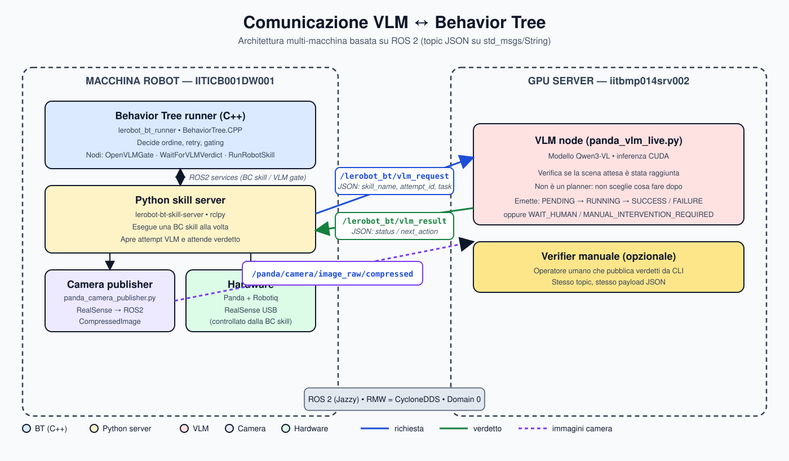
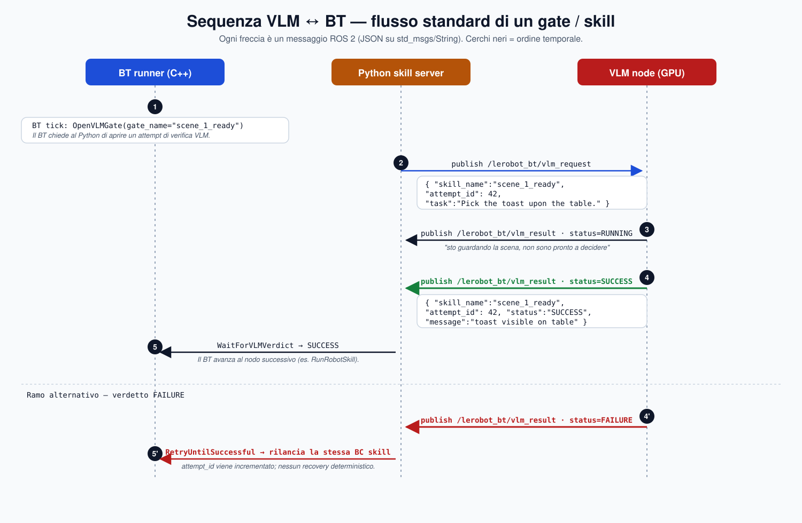
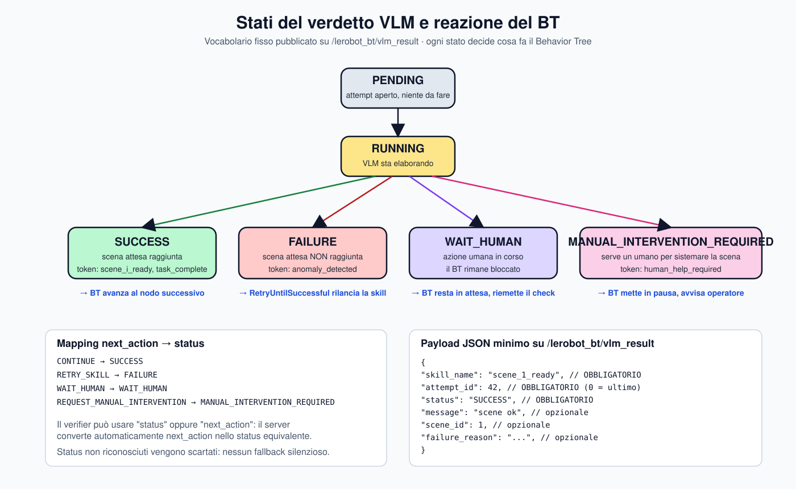

<!-- _class: title -->

# VLM ↔ Behavior Tree
## A scene‑gated runtime for real‑robot manipulation

LeRobot BT stack · Multi-machine ROS 2 architecture

---

# The problem

- We need a robot that runs **long, multi-step manipulation tasks** on a real Panda + Robotiq.
- Single end-to-end policies are **brittle**: one bad step contaminates the whole episode.
- We want:
  - **Explicit task structure** (which skill, in which order, with which retries).
  - **Visual verification** that each step really happened.
  - **Graceful handling** of failures and human help.

> Idea: split **planning** (BT), **execution** (BC skill), and **verification** (VLM) into three independent components.

---

# Three roles, one contract

<div class="cols">
<div class="card">
<h3>BT — planner</h3>

- BehaviorTree.CPP (C++).
- Owns **task order**, **gating**, and **retry boundaries**.
- Does not look at pixels.
</div>
<div class="card">
<h3>BC skill — actor</h3>

- One trained manipulation primitive at a time (ACT, SmolVLA, Diffusion, π0…).
- Executes; does not decide what comes next.
</div>
</div>

<div class="card" style="margin-top:24px">
<h3>VLM — verifier (not a planner)</h3>

- Reports whether the **expected scene state** was reached.
- Vocabulary: <code>SUCCESS · FAILURE · RUNNING · WAIT_HUMAN · MANUAL_INTERVENTION_REQUIRED</code>.
- Never chooses the next object, never rewrites the task.
</div>

---

# Architecture — two machines, two topics



<footer>ROS 2 Jazzy · CycloneDDS · Domain 0 · JSON payloads on <code>std_msgs/String</code></footer>

---

# Why split across two machines?

- **Robot machine** (`IITICB001DW001`)
  - Hard real-time-ish loop: BT tick, BC inference, gripper, RealSense USB.
  - Runs the BT runner + Python skill server + camera publisher.
- **GPU server** (`iitbmp014srv002`)
  - Heavy VLM (Qwen3-VL) inference, decoupled from the control loop.
  - One verifier can serve any task XML without touching the robot stack.

**Loose coupling**: the only contract is two JSON topics.
Replacing the VLM with a manual verifier is a drop-in swap.

---

# The standard flow (per gate or skill)



---

# What travels on the wire

<div class="cols">
<div class="card">
<h3>Request — <code>/lerobot_bt/vlm_request</code></h3>

```json
{
  "skill_name": "scene_1_ready",
  "attempt_id": 42,
  "task": "Pick the toast upon the table."
}
```

Published by the **Python skill server** each time the BT opens a gate or finishes a skill.
</div>
<div class="card">
<h3>Result — <code>/lerobot_bt/vlm_result</code></h3>

```json
{
  "skill_name": "scene_1_ready",
  "attempt_id": 42,
  "status": "SUCCESS",
  "message": "toast visible on table"
}
```

Published by the **VLM** (or a human verifier). `skill_name` + `attempt_id` are echoed back — that is the join key.
</div>
</div>

---

# Verdict vocabulary drives BT behaviour



---

# Failure handling — by design

- **No hidden recovery motion.** If the VLM says `FAILURE`, the BT’s `RetryUntilSuccessful` simply re-runs the **same BC skill** with a new `attempt_id`.
- **No silent fallbacks.** Unknown status strings are rejected at the bridge.
- **Humans are first-class.**
  - `WAIT_HUMAN` → BT stalls; verifier re-checks the scene.
  - `MANUAL_INTERVENTION_REQUIRED` → BT pauses, operator is notified.
- **`next_action` ⇄ `status`** mapping keeps the verifier ergonomic
  (`CONTINUE` → `SUCCESS`, `RETRY_SKILL` → `FAILURE`, …).

---

# Why this design pays off

<div class="cols">
<div class="card">
<h3>Debuggable</h3>

Each tick, gate, and verdict is a logged ROS 2 message — full replay from topics.
</div>
<div class="card">
<h3>Swappable models</h3>

Change a single executor YAML field (`policy_variant`) to switch ACT ↔ SmolVLA ↔ π0 — BT XML untouched.
</div>
</div>

<div class="cols" style="margin-top:24px">
<div class="card">
<h3>Reusable VLM</h3>

The same verifier serves every task XML; no per-task fine-tuning of the planner.
</div>
<div class="card">
<h3>Safe by default</h3>

Without a verdict the BT never advances — no “open-loop” drift between skills.
</div>
</div>

---

# Current status

- BT runtime in C++ ticking real tasks on Panda + Robotiq.
- Python skill server orchestrating BC skills (ACT, SmolVLA, Diffusion, π0 variants).
- Qwen3-VL verifier on the GPU server, validated end-to-end with
  `simulate_vlm_test.py` and `test_vlm_protocol.py`.
- Tasks already wired: <span class="tag">make_coffee</span> <span class="tag">make_sandwich</span> <span class="tag">items_in_drawer</span> <span class="tag">set_breakfast_table</span> <span class="tag">prepare_picnic_bag</span>

---

# Next steps

- Richer VLM scene templates (multi-object, ordinal “first/second” reasoning).
- Per-skill confidence thresholds → automatic `WAIT_HUMAN` escalation.
- Dataset convention `(scene_i, BC skill, scene_{i+1})` enforced at collection time.
- Quantitative evaluation: success rate vs. monolithic policies on the same tasks.

---

<!-- _class: title -->

# Thank you
## Questions?

